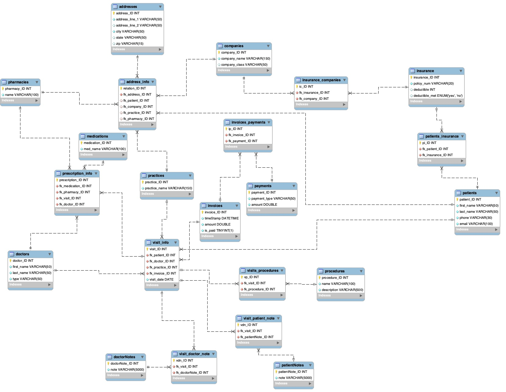

# relational-EMR-DB-SQL

I. Objective: create a relational database in SQL to simulate an electronic medical record system for a small hospital. more specifically, our system keeps track of... 
- general patient info (name, address, etc.)
- medical history (conditions, medications)
- administrative info (pharmacy, insurance plan + company) 
- visits (doctor, location, date, procedures completed, any associated notes)
- general finances (invoices, payments) 

II. Context: 
- this project was completed as part of INFSCI 2710: Database Management (University of Pittsburgh) 
- besides myself, group members included Emily Conner and Yicheng Zhang

III. Relational Schema: 

 
I.	Introduction/Abstract
In this project, we have designed an electronic health record information system that is intended to be used by a small hospital system. This system allows users to view their patient information, doctors to view information about the patient, patients to be added to the system, and doctors to add notes about the patient. Relations in the database consist of patient and visit information, medications prescribed and procedures done at the visit, doctor information, as well as insurance and practice details. There are also invoice and payment relations in the database to keep track of payment details.
	The target audience for this system is a small hospital system. The benefit of this system is that it enables smaller hospital systems to keep track of all the health records electronically without having to purchase an expensive license from an outside company where the design is more targeted to larger hospital systems. This design will serve as an efficient, small-scale electronic health record information system with lower overhead than current market systems.
II.	UML-compliant E-R Model
 
III.	Business Rules

Entity 1	Entity 2	Cardinality (Entity 1 Side)	Cardinality (Entity 2 Side)	Business Rule(s)
patients	insurance	1..*	1..*	A given patient may have one or more health insurance plans (ex: primary plan, secondary plan). A given insurance plan may be associated with one or more patients (ex: family plan).
patients	addresses	1..*	1	A given patient should only have one address on file (i.e., primary address for contact info). A given address may correspond to one or more patients (ex: family living in one house). 
Junction table: address_info
patients	visit_info (visits)	1	1..*	A given patient may have one or more visits (patient would not be registered if they had zero). A given visit should only correspond to one patient. 
insurance	companies	1..*	1	A given insurance plan must only be associated with one insurance company. A given company may issue one or more insurance plans. 
Junction table: insurance_companies
companies	addresses	1	1..*	A given insurance company may have one or more addresses on file (ex: if different branches of insurance company are located at different addresses). A given address must only be associated with one company (i.e., multiple companies do not share same address). 
Junction table: address_info
pharmacies	addresses	1	1..*	A given pharmacy may have one or more addresses on file (ex: CVS has many locations). A given address should only be associated with one pharmacy.
Junction table: address_info
practices	addresses	1	1	A given practice should only be located at one address. A given address should only correspond to one practice (even if multiple practices are located at same address, floor/apartment number should also be listed). 
Junction table: address_info
practices	visit_info (visits)	1	1..*	A given practice may host one or more visits (the practice would not be in the system if it hosted zero visits). A given visit may only occur at one practice. 
prescription_info (prescriptions)	medications	1..*	1	A given prescription should only be for one medication. A given medication may be included in one or more prescriptions (the medication would not be in the system if it was not part of any prescriptions).  
prescription_info (prescriptions)	doctors	0..*	1	A given prescription should only come from one doctor’s order. A given doctor may have ordered anywhere from zero to many prescriptions. 
prescription_info (prescriptions)	visit_info
(visits)	0..*	1	A given prescription should be ordered as a result of only one visit. A given visit may result in anywhere from zero to many prescriptions being ordered. 
doctors	visit_info
(visits)	1	1..*	A given doctor may attend one or more visits (the doctor would not be in the system if they had no visits). A given visit may only be associated with one doctor. 
procedures	visit_info
(visits)	0..*	1..*	A given procedure may be used at one or more visits (the procedure would not be in the system if it was not used in any visits). A given visit may involve anywhere from zero to many procedures. 
Junction table: visits_procedures
visit_info (visits)	invoices	1	1	A given visit may only generate one invoice. A given invoice should only correspond to one visit. 
invoices	payments	1	0..*	A given invoice may correspond to anywhere from zero to many payments (patient may not have paid bill at all yet, or may pay bill in smaller chunks). A given payment should only be for one invoice.  
Junction table: invoices_payments
visit_info (visits)	doctorNotes	1	0..*	A given visit may correspond to anywhere from zero to many doctor notes (doctor may not feel that a note is necessary, or may enter notes at different points in time for visit). A given doctor note should only correspond to one visit. 
Junction table: visit_doctor_note

 
IV.	Entity/Attribute descriptions 

patients
patient_ID (pk)	INT	Primary ID for patients table
first_name	VARCHAR(50)	Patient’s last name
last_name	VARCHAR(50)	Patient’s first name
phone	VARCHAR(30)	Patient’s phone number
email	VARCHAR(100)	Patient’s email
dob	DATE	Patient’s date of birth

patients_insurance
pi_ID (pk)	INT	Primary ID for patients-insurance junction table
fk_patient_ID (fk)	INT	Foreign key referencing patients table
fk_insurance_ID (fk)	INT	Foreign key referencing insurance table

insurance
insurance_ID	INT	Primary ID for insurance table
policy_num	VARCHAR(20)	Policy number for health insurance plan
deductible	INT	Dollar amount of deductible for insurance plan
deductible_met	ENUM(“yes”, “no”)	Describes whether patient’s deductible is met
plan	VARCHAR(50)	Type of health insurance plan (ex: HMO, PPO)

insurance_companies
ic_ID (pk)	INT	Primary ID for insurance-companies junction table
fk_insurance_ID (fk)	INT	Foreign key referencing insurance table 
fk_company_ID (fk)	INT	Foreign key referencing company table 

companies
company_ID (pk)	INT	Primary ID for companies table
company_name	VARCHAR(150)	Name of insurance company

address_info
relation_ID (pk)	INT	Primary ID for address info table
fk_address_ID (fk)	INT	Foreign key referencing addresses table
fk_patient_ID (fk)	INT (null option)	Foreign key referencing patients table (patient address; optional)
fk_company_ID (fk)	INT (null option)	Foreign key referencing companies table (insurance company address; optional)
fk_practice_ID (fk)	INT (null option)	Foreign key referencing practices table (practice address; optional)
fk_pharmacy_ID (fk)	INT (null option)	Foreign key referencing pharmacies table (pharmacy address; optional)

addresses
address_ID (pk)	INT	Primary ID for addresses table
address_line_1	VARCHAR(50)	First line of address
address_line_2	VARCHAR(50) (null option)	Second line of address (optional)
city	VARCHAR(50)	City of address
state	VARCHAR(50)	State of address
zip	VARCHAR(15)	ZIP code for address

pharmacies
pharmacy_ID (pk)	INT	Primary ID for pharmacies table
name	VARCHAR(100)	Name of pharmacy

practices
practice_ID (pk)	INT	Primary ID for practices table
practice_name	VARCHAR(150)	Name of practice

prescription_info
prescription_ID (pk)	INT	Primary ID for prescription info table
fk_medication_ID (fk)	INT	Foreign key referencing medications table (medication which was ordered)
fk_pharmacy_ID (fk)	INT	Foreign key referencing pharmacies table (pharmacy where prescription was ordered)
fk_visit_ID (fk)	INT	Foreign key referencing visits table (visit where prescription was ordered)
fk_doctor_Id (fk)	INT	Foreign key referencing doctors table (doctor who ordered prescription)

medications
medication_ID (pk)	INT	Primary ID for medications table
med_name	VARCHAR(100)	Name of medication

doctors
doctor_ID (pk)	INT	Primary ID for doctors table
first_name	VARCHAR(50)	Doctor’s first name
last_name	VARCHAR(50)	Doctor’s first name
type	VARCHAR(50)	Type of doctor (ex: cardiologist)

visit_info
visit_ID (pk)	INT	Primary ID for visit info table
fk_patient_ID (fk)	INT	Foreign key referencing patients table (patient who visit was for)
fk_doctor_ID (fk)	INT	Foreign key referencing doctors table (doctor who attended visit)
fk_practice_ID (fk)	INT	Foreign key referencing practices table (practice where visit was conducted)
fk_invoice_ID (fk)	INT	Foreign key referencing invoices table (invoice which was generated for visit)
visit_date	DATE	Date of the visit

invoices
invoice_ID (pk)	INT	Primary ID for invoices table
amount	DOUBLE	Invoice amount (i.e., cost of visit)
is_paid	TINYINT(1)	Whether or not the invoice is currently paid

invoices_payments
ip_ID (pk)	INT	Primary ID for invoices-payments junction table
fk_invoice_ID (fk)	INT	Foreign key referencing invoices table
fk_payment_ID (fk)	INT	Foreign key referencing payments table

payments
payment_ID (pk)	INT	Primary ID for payments table
payment_type	VARCHAR(50)	Form of the payment (ex: insurance, mastercard, discover)
amount	DOUBLE	Payment amount
time_stamp	DATETIME	Time stamp (date and time) for payment

visits_procedures
vp_ID (pk)	INT	Primary ID for visits-procedures junction table
fk_visit_ID (fk)	INT	Foreign key referencing visits table
fk_procedure_ID (fk)	INT	Foreign key referencing procedures table 

procedures
procedure_ID (pk)	INT	Primary ID for procedures table
name	VARCHAR(100)	Name of procedure
description	VARCHAR(500)	Brief description of procedure

visit_doctor_note
vdn_ID (pk)	INT	Primary ID for visit_info-doctorNotes junction table
fk_visit_ID (fk)	VARCHAR(50)	Foreign key referencing visit_info table
fk_doctorNote_ID (fk)	VARCHAR(50)	Foreign key referencing doctorNotes table

doctorNotes
doctorNote_ID (pk)	INT	Primary ID for doctorNotes table
note	VARCHAR(5000)	Doctor’s note

